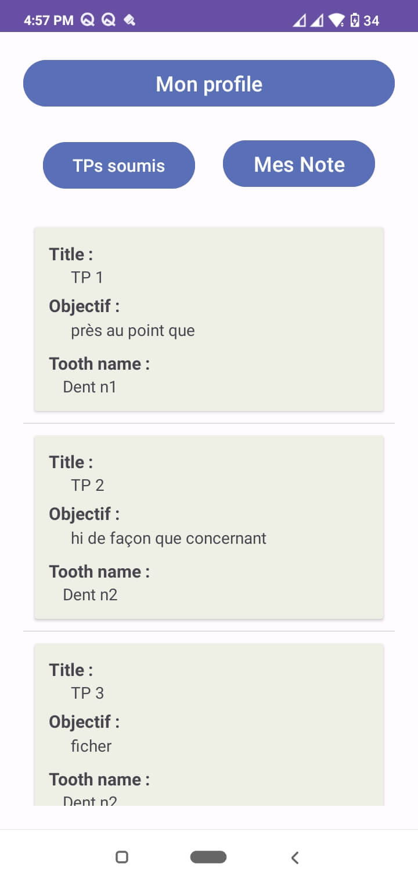

## Description
Cette application web est conçue pour la gestion des professeurs et des étudiants de différents niveaux au sein de la faculté de dentaire. Elle permet une organisation efficace des cours, des travaux pratiques, et des évaluations. La version mobile de l'application est spécifiquement dédiée aux étudiants, leur permettant d'effectuer et d'envoyer les mesures nécessaires lors des travaux pratiques directement aux professeurs pour évaluation.

## Démonstration
Pour voir une démonstration de notre application, veuillez consulter le lien suivant :
lien: https://github.com/AbderrahmaneOd/Dental-Taper-Mobile/assets/98269071/85850425-558a-4cfe-ac21-868c8d73f026

## Fonctionnalités

### 1. Login
   

### 2. Liste des TPs
   

### 3. Calcule des angles
   

### 4. TPs soumis
   
   
### 4. Suivie de Notes
   
   
### Mise en place avec Docker
Pour installer et exécuter cette application en utilisant Docker, suivez ces étapes :

docker pull belk732/profetudiant
docker run -d -p 80:80 belk732/profetudiant

### Test de la Qualité du Code avec SonarQube

# Installer SonarQube (si non installé)
docker pull sonarqube

# Lancer SonarQube
docker run -d -p 9000:9000 sonarqube
